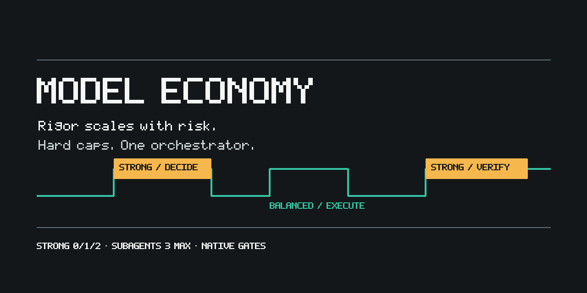
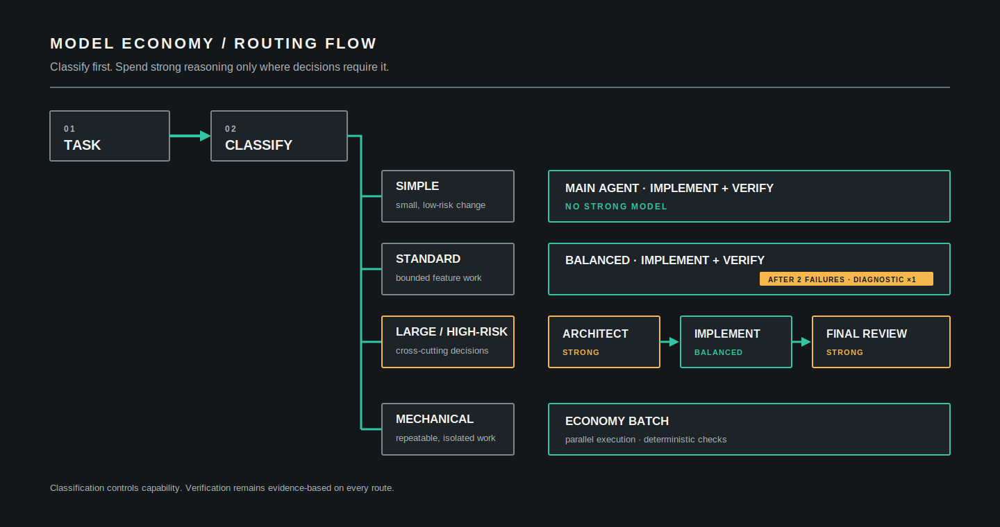

[简体中文](README.zh-CN.md)

# Model Economy

> Use strong models for decisions, not routine work.



Model Economy is a Codex plugin for capability-aware development workflows. It keeps high-capability models at design, risk, and final-review gates; routes implementation and bounded research to suitable lower-cost capability tiers; and applies native lightweight quality gates for approval, planning, testing, and verification.

It can display local CodexBar token and estimated-cost summaries. It does not scan sessions itself, promise savings, verify model or role identity, or replace engineering judgment.

## Why it exists

- Reserve `strong` capability for consequential decisions instead of routine edits.
- Match investigation, implementation, review, and fixed-rule batch work to explicit role boundaries.
- Require approval only for material ambiguity or high-risk decisions, and scale testing to behavioral risk.
- Always require fresh completion evidence without forcing a full methodology onto simple work.

## How it works



Tasks are classified in a fixed order: large or high-risk, mechanical, simple, then standard. The first matching class decides the permitted roles and the maximum number of `strong` calls. See [how it works](docs/en/how-it-works.md) for the complete policy.

Superpowers is not a dependency. Even when it is installed or enabled, Model Economy remains the default workflow. Handoff occurs only when the user explicitly requests “full Superpowers” or “Superpowers strict mode” for the current task.

## Install in 60 seconds

```sh
git clone https://github.com/BottleYo/model-economy.git
cd model-economy
codex plugin marketplace add .
codex plugin add model-economy@model-economy-public
python3 plugins/model-economy/scripts/model_economy.py install --profile inherited
python3 plugins/model-economy/scripts/model_economy.py verify
```

Use `py -3.11` in place of `python3` on Windows. The full installation, upgrade, migration, and removal guide is in [Installation](docs/en/installation.md).

## View usage

With CodexBar 0.41.0 or later installed, view local Codex usage without exposing account credentials:

```sh
python3 plugins/model-economy/scripts/model_economy.py usage
python3 plugins/model-economy/scripts/model_economy.py usage --days 7 --project .
python3 plugins/model-economy/scripts/model_economy.py usage --format json
```

The adapter reports CodexBar's local token totals, model breakdowns, and estimated cost. It does not attribute tokens to Model Economy roles.

## Task classification

| Class | Conditions | Default capability | `strong` maximum |
| --- | --- | --- | --- |
| Large or high-risk | Any high-risk boundary, new architecture, or wide blast radius | `strong` gates plus `balanced` implementation | 2 |
| Mechanical | All five fixed-rule conditions hold | `economy` batch work | 0 |
| Simple | Known files, no open judgment, direct verification, and no creative or behavioral change | Main agent | 0 |
| Standard | The fallback class | `balanced` | 1 |

## Roles

| Role | Capability | Access | Responsibility |
| --- | --- | --- | --- |
| `model-economy-architect` | `strong` | Read only | Architecture boundaries, risks, and decisions before high-risk design approval |
| `model-economy-final-reviewer` | `strong` | Read only | Findings, evidence gaps, and residual risk after high-risk verification |
| `model-economy-implementer` | `balanced` | Workspace write | Approved implementation, tests, and verification |
| `model-economy-reviewer` | `balanced` | Read only | Independent findings and regression risks |
| `model-economy-explorer` | `economy` | Read only | Minimal file inventory and facts |
| `model-economy-batch-worker` | `economy` | Workspace write | Fixed-rule edits with per-item checks |

## Lightweight engineering skills

Version 0.5.0 includes three independently triggered leaf skills:

- `domain-context` extracts only the domain vocabulary, invariants, and ADR constraints needed by the current task.
- `module-design` checks module boundaries, knowledge leakage, and change surface, then suggests the smallest structural improvement.
- `disposable-prototype` answers a concrete unknown with an isolated throwaway experiment instead of treating exploratory code as production work.

These skills start no subagents, do not change task classification, model mapping, the six-role topology, or quality gates, and never commit on their own. Production implementation returns to `cost-aware-development` routing. They are built into the plugin and add no dependency on an external engineering-method plugin.

## Global routing

After installation, add the generic development-routing block to your global `$CODEX_HOME/AGENTS.md`:

```sh
python3 plugins/model-economy/scripts/model_economy.py enable-global-routing
```

The command is idempotent and changes only the marked, managed Model Economy block. A project's own `AGENTS.md` can override the global rule. Remove the block with:

```sh
python3 plugins/model-economy/scripts/model_economy.py disable-global-routing
```

## Security and trust boundaries

The local CLI manages only its configuration, its declared agent files under `CODEX_HOME`, and the marked, managed Model Economy block in `$CODEX_HOME/AGENTS.md`. It fails closed on missing, damaged, or conflicting managed state. Only an explicit user-authorized `--force` operation overrides the relevant ownership or conflict guard. It does not manage credentials, project data, unowned files, other plugins, or access control for `CODEX_HOME`.

`doctor --smoke` can observe whether a subagent starts. Current Codex JSONL does not provide `agent_type`, so role identity and model identity remain unverified. Read [Security](SECURITY.md) before reporting a vulnerability.

## Documentation

- [Installation](docs/en/installation.md): prerequisites, install, upgrade, profile transfer, and uninstall.
- [How it works](docs/en/how-it-works.md): classification, role boundaries, approval gates, and limits.
- [CLI reference](docs/en/cli-reference.md): commands, options, and exit codes.
- [Security policy](SECURITY.md): private vulnerability reporting and release checks.
- [Changelog](CHANGELOG.md): released changes.

## Current limitations

- Usage summaries come from optional CodexBar local statistics; Model Economy does not scan sessions itself or attribute tokens to roles.
- `doctor --smoke` does not verify role or model identity.
- The plugin does not install, toggle, or modify Superpowers; it hands off orchestration only after explicit strict authorization for the current task.
- Global routing does not include project-specific context and is not removed automatically by plugin uninstall.

## Contributing

Run the local checks before opening a change:

```sh
python3 -m unittest discover -s tests -v
python3 scripts/check_sensitive_content.py .
```

For a custom model mapping, pass all three capability tiers on one line:

```sh
# 3. custom
python3 plugins/model-economy/scripts/model_economy.py configure --strong <strong-model> --balanced <balanced-model> --economy <economy-model>
py -3.11 plugins/model-economy/scripts/model_economy.py configure --strong <strong-model> --balanced <balanced-model> --economy <economy-model>
```

## License

[MIT](LICENSE)
