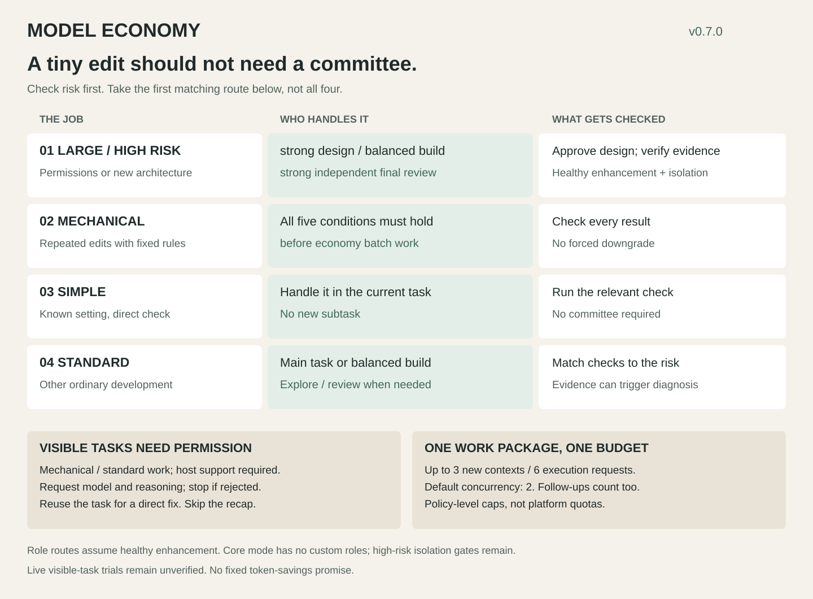

[简体中文](README.zh-CN.md)

# Model Economy

A tiny edit should not need a committee.

A free, open-source Codex plugin that guides model choice, task assignment, and checks according to risk, with less unnecessary coordination.

- Keep small jobs in the current task; consider lighter models for fixed-rule batch work.
- Set models and reasoning per role. Separate visible tasks need your authorization and host support.
- Keep design and review gates for high-risk work. Less ceremony does not mean skipping checks.

[Current release: v0.7.0](docs/release/0.7.0.md) · [Installation guide](docs/en/installation.md) · [Report an issue](https://github.com/BottleYo/model-economy/issues)

<details>
<summary>See the task-routing diagram</summary>



</details>

## Install

Requires Git and a Codex CLI with plugin commands. Run in a terminal:

```sh
git clone https://github.com/BottleYo/model-economy.git
cd model-economy
codex plugin marketplace add .
codex plugin add model-economy@model-economy-public
```

Start a new task and say “Use Model Economy for this task.” To skip it, say “This task must not use Model Economy.”

This installs core mode; no six-role setup is required. See the [installation guide](docs/en/installation.md) for custom models, optional enhancement, usage summaries, and removal.

## Already installed? Ask Codex to update it

Copy the prompt below into Codex on the computer you want to update. No version number to maintain.

<details>
<summary>Copy the reusable update prompt</summary>

```text
Update this computer's installed Model Economy to the latest stable GitHub release:
https://github.com/BottleYo/model-economy

First identify the latest non-prerelease Release, installed version, installation source, repository location, and whether six-role enhancement and global routing are enabled. Stop if no stable release can be confirmed; do not substitute main or a prerelease.
Follow the target version's installation guide and commands supported by this Codex host. Preserve uncommitted work, model mappings, and effective reasoning settings. Updating the repository alone is not a completed plugin update.
If six-role enhancement exists, run upgrade --dry-run, then upgrade only if there are no conflicts, followed by verify. Retain migration backups. If enhancement is absent, skip it; do not install it as an extra.
Refresh the managed block with enable-global-routing only if global routing was already enabled. Do not reset settings with install/configure or bypass conflicts with --force.
Do not read authentication or session files, run doctor --smoke, create test subtasks, or change other plugins. Stop and explain conflicts, unsupported commands, or an unknown source.
Verify the installed plugin snapshot and optional enhancement separately. Report versions, checks, backup locations, and anything unfinished; remind me to start a new task for the new rules. A source version reported by status does not prove the installed plugin snapshot was updated.
```

</details>

## Before you use it

- These are workflow rules, not a platform-enforced scheduler. The plugin does not switch your current chat's model or promise fixed token savings.
- Core mode pauses for your choice when high-risk work needs isolated roles that are unavailable.
- v0.7.0 automated checks passed. Live visible-task creation, continuation, and complex parallel trials were waived and remain unverified.
- A community project, not an official OpenAI product.

## Documentation

[How it works](docs/en/how-it-works.md) · [CLI reference](docs/en/cli-reference.md) · [Security](SECURITY.md) · [Changelog](CHANGELOG.md) · [Contributing](CONTRIBUTING.md) · [Support](SUPPORT.md)

[MIT license](LICENSE)
