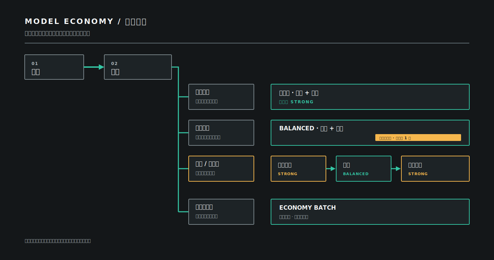

[English](README.md)

# Model Economy

> 让强模型负责关键判断，而不是日常机械工作。


如果一套工作流用同一套阵仗处理配置修改、已知缺陷和架构变更，每个任务都要经历提问、规格、长计划、多个 subagent 和多轮审查。高风险任务确实需要这些步骤，但把它们照搬到日常修改上，只会增加消耗和等待。

Model Economy 先判断任务风险，再决定由谁来做。模型路由只是表面结果；真正起作用的是一套有上限的开发规则：什么能力档位可以参与、每个角色能改什么、何时需要审批，以及一次任务最多允许多少编排开销。

它还可以显示 CodexBar 的本地 token 与估算成本摘要，但不自行扫描 session，不承诺节省结果，不验证模型或角色身份，也不替代工程判断。

## 为什么需要它

- 改一行配置，不该自动升级成一套项目仪式。
- 涉及权限、架构或大范围影响时，仍应由强模型做架构判断和独立终审。
- Agent 应该有策略级上限，不能无限追加 subagent 或不断升级模型。
- “完成”需要与风险相称的新鲜证据，而不是一句自信的状态说明。

## 特别之处

| 约束 | 实际作用 |
| --- | --- |
| 先判风险，再选模型 | 每个任务先归入简单、标准、机械或大型/高风险，再确定角色与能力档位。 |
| 强模型调用有策略级上限 | 各类任务的 `strong` 上限为 `0`、`1` 或 `2`；这是路由策略限制，不代表平台强制额度，也不证明模型身份。 |
| 角色自带权限边界 | 强模型架构师和终审员只读；正式实现交给 `balanced`，固定规则批处理才可能使用 `economy`。 |
| 编排规模受控 | 每个任务最多启动三个 subagent，禁止递归委派；小任务通常一个也不启动。 |
| 质量门随风险变化 | 意图、审批、计划、测试和完成证据都有原生规则，但例行工作不会被迫走完整方法论。 |
| 同一任务只有一个编排者 | 不会在 Model Economy 之上悄悄叠加另一套流程。只有当前任务得到明确授权，才交给完整 Superpowers。 |

三个可选叶子 Skill 用来压缩上下文：`domain-context` 只提取相关业务约束，`module-design` 检查边界与变更面，`disposable-prototype` 用一次性代码回答具体未知。它们都不会启动 subagent，也不会接管任务编排。

## Model Economy 与完整 Superpowers

[Superpowers](https://github.com/obra/superpowers) 将自己定义为一套**完整软件开发方法论**，其强制工作流覆盖需求探索、设计确认、实施计划、worktree、测试驱动开发、任务执行、代码审查和分支收尾。需要每个开发任务都遵守完整纪律时，这套端到端流程很有价值。Model Economy 选择了另一种默认值：任务有多大风险，就使用多少流程。

| | Model Economy | 完整 Superpowers 工作流 |
| --- | --- | --- |
| 首要目标 | 按风险控制能力、成本暴露、权限和完成证据 | 从需求意图到分支收尾执行完整开发方法论 |
| 默认入口 | 先分类；简单任务可以直接执行 | 开发类任务先进入 brainstorming 和设计澄清 |
| 计划与测试 | 随歧义和行为风险调整 | 详细计划与严格 RED-GREEN-REFACTOR TDD 是核心要求 |
| Subagent | 按需启用、不可递归，每个任务最多三个 | 可为计划中的每项任务启动新 subagent，并做两阶段审查 |
| 强模型预算 | 明确按类别封顶：`0` / `1` / `2` | 公开工作流没有给出相同的能力档位调用上限 |
| 更适合 | 既要日常开发速度，又不愿牺牲高风险审查的场景 | 用户明确希望整项任务采用完整方法论的场景 |
| 共存方式 | 默认掌握编排权，只在当前任务明确要求时交接 | 收到这次明确交接后再接管编排 |

这是工作方式的选择，不是“谁在所有场景都更好”。如果某项任务需要完整 Superpowers，直接说“完整 Superpowers”或“Superpowers strict mode”。Model Economy 会退回到模型与成本建议，不再追加第二套流程。

## 工作原理



任务按固定顺序分类：大型或高风险、机械、简单、标准。首个命中的类别决定可用角色与 `strong` 调用上限。完整规则见[工作原理](docs/zh-CN/how-it-works.md)。

下表中的角色名称只描述健康的**增强模式**。核心模式下，简单、机械和标准任务由主 Agent 执行；大型/高风险任务会在下文说明的兼容关口停止。

| 例子 | 增强模式路线 |
| --- | --- |
| 配置项和文件都已知，可直接检查 | 简单：主 Agent 直接处理，不启用 subagent，`strong` 上限为 `0` |
| 规则固定、文件范围有限、每项都能单独验证的重复修改 | 机械：五项机械条件全部满足后，交给 `economy` 批处理角色 |
| 涉及多个模块，但产品行为已知的缺陷 | 标准：由 `balanced` 实现；只有确实需要证据时才启用 explorer 或 reviewer |
| 认证、权限、新架构或影响范围很广 | 大型/高风险：强模型架构师只读设计，`balanced` 实现，强模型终审员只读验收；`strong` 上限为 `2` |

## 核心模式与增强模式

目录式安装默认进入**核心模式**。四个 Skill 都不依赖用户级六角色文件：简单、机械和标准任务由主 Agent 执行，原生质量门仍然生效。核心模式不声称具备自定义角色隔离或独立模型映射。

仓库内的本地 CLI 可以安装**增强模式**，增加六个本地角色定义以及继承式或显式的三档模型映射。只有六角色齐全、受管理哈希匹配且模板为当前版本时，增强模式才算启用；部分缺失、被修改或过期会报告为 `degraded` 并失败关闭。

核心模式遇到大型/高风险任务时，会明确说明独立架构师与终审员不可用。用户可以安装增强模式，或明确批准降低保障的单 Agent 路线；后者不得被描述为完整的 Model Economy 高风险流程。两种模式都不验证模型或角色身份。

## 安装

```sh
git clone https://github.com/BottleYo/model-economy.git
cd model-economy
codex plugin marketplace add .
codex plugin add model-economy@model-economy-public
```

这是正式的仓库安装路径，完成后即可使用核心模式；安装后请新建任务。若需要可选的六角色增强，默认使用 `inherited` 档案：

```sh
python3 plugins/model-economy/scripts/model_economy.py install --profile inherited
python3 plugins/model-economy/scripts/model_economy.py verify
python3 plugins/model-economy/scripts/model_economy.py status
```

Windows 请将 `python3` 替换为 `py -3.11`。模型档案、全局路由、CodexBar 用量、升级、跨设备迁移和卸载都放在[安装指南](docs/zh-CN/installation.md)与 [CLI 参考](docs/zh-CN/cli-reference.md)的进阶章节。

## 首次体验

可以分别用三种风险级别的提示词检查路线是否符合预期：

| 提示词 | 核心模式预期路线 |
| --- | --- |
| “把已知的超时常量从 20 改成 30，并运行直接测试。” | 简单：主 Agent 处理，直接验证，不调用自定义角色。 |
| “修复这个可复现、同时涉及解析器和渲染器的缺陷，并运行聚焦与回归测试。” | 标准：主 Agent 处理，使用短计划和与风险匹配的质量门。 |
| “重构认证系统并迁移现有权限。” | 大型/高风险：报告缺少独立架构师与终审员，停下来让用户选择。 |

使用 `model_economy.py status --format text|json` 查看模式。若只想在当前任务停用，可以说“本任务不要使用 Model Economy”。若保留插件但移除增强模式，运行 `uninstall`；使用 `uninstall --purge` 可同时删除本地配置与状态。

## 按你的方式使用

Model Economy 可以在单次任务、项目、全局路由和插件四个层级控制。

| 范围 | 控制方法 |
| --- | --- |
| 只在当前任务使用 | 说：`本任务使用 Model Economy。` |
| 当前任务不用 | 说：`本任务不要使用 Model Economy。` |
| 项目规则 | 在项目自己的 `AGENTS.md` 中写明规则；项目指令优先于全局规则。 |
| 全局默认 | 使用下方的 `enable-global-routing` 或 `disable-global-routing`。 |
| 已安装插件 | 在 Codex Desktop 打开 **插件 → 已安装 → Model Economy**，切换开关后新建任务。 |

在仓库根目录开启全局默认路由：

```sh
python3 plugins/model-economy/scripts/model_economy.py enable-global-routing
```

不卸载插件，只关闭全局默认路由：

```sh
python3 plugins/model-economy/scripts/model_economy.py disable-global-routing
```

插件开关和全局 `$CODEX_HOME/AGENTS.md` 路由块彼此独立。若要完全停用，请关闭全局路由、关闭已安装插件，再新建任务；如果只是偶尔不想使用，一句当前任务指令就够了。

### 查看用量

安装 CodexBar 0.41.0 或更高版本后，可以在不暴露账号凭据的情况下查看本地 Codex 用量：

```sh
python3 plugins/model-economy/scripts/model_economy.py usage
python3 plugins/model-economy/scripts/model_economy.py usage --days 7 --project .
python3 plugins/model-economy/scripts/model_economy.py usage --format json
```

适配器显示 CodexBar 的本地 token 总量、模型拆分与估算成本，不会把 token 归因到 Model Economy 角色。

## 任务分类

| 类别 | 条件 | 增强模式默认能力 | `strong` 策略上限 |
| --- | --- | --- | --- |
| 大型或高风险 | 任一高风险边界、新架构或影响范围很广 | `strong` 关口加 `balanced` 实现 | 2 |
| 机械 | 五项固定规则条件全部满足 | `economy` 批处理 | 0 |
| 简单 | 文件已知、无开放判断、可直接验证，且不改变创意或行为 | 主 Agent | 0 |
| 标准 | 兜底类别 | `balanced` | 1 |

## 增强模式角色

| 角色 | 能力 | 权限 | 职责 |
| --- | --- | --- | --- |
| `model-economy-architect` | `strong` | 只读 | 高风险设计审批前输出架构边界、风险与决策 |
| `model-economy-final-reviewer` | `strong` | 只读 | 高风险验证后输出问题、证据缺口与剩余风险 |
| `model-economy-implementer` | `balanced` | 可写工作区 | 在批准范围内实现、测试和验证 |
| `model-economy-reviewer` | `balanced` | 只读 | 给出独立问题与回归风险 |
| `model-economy-explorer` | `economy` | 只读 | 最小文件清单与事实收集 |
| `model-economy-batch-worker` | `economy` | 可写工作区 | 按固定规则编辑并逐项检查 |

## 轻量工程能力

0.6.0 候选版提供三个可独立触发的叶子 Skill：

- `domain-context`：只提炼当前任务需要的领域术语、不变量与 ADR 约束。
- `module-design`：检查模块边界、知识泄漏和变更面，给出最小结构改进。
- `disposable-prototype`：用隔离的一次性实验回答具体未知，不把探索代码当成品。

这些 Skill 不启动 subagent，不改变任务分类、模型映射、六角色拓扑或质量门，也不自行提交代码。涉及正式实现时仍回到 `cost-aware-development` 路由。它们是插件内置能力，不依赖外部工程方法插件。

## 全局路由

`enable-global-routing` 会把通用开发路由加入 `$CODEX_HOME/AGENTS.md`。命令可重复执行，只会改动带标记的 Model Economy 受管理区块。项目自己的 `AGENTS.md` 可以覆盖全局规则；`disable-global-routing` 只删除这段受管理区块。

## 安全与信任边界

本地 CLI 只管理 `CODEX_HOME` 下自己的配置、声明过的角色文件，以及 `$CODEX_HOME/AGENTS.md` 中带标记的 Model Economy 受管理区块；缺失、损坏或冲突的受管理状态会失败关闭。只有用户明确授权的 `--force` 操作可以越过相应的归属或冲突保护。它不管理凭据、项目数据、未归属文件、其他插件，也不接管 `CODEX_HOME` 的访问控制。

`doctor --smoke` 只能观察 subagent 是否启动。当前 Codex JSONL 不提供 `agent_type`，因此角色身份和模型身份均未验证。报告漏洞前请阅读[安全策略](SECURITY.zh-CN.md)。

## 文档

- [安装指南](docs/zh-CN/installation.md)：前置条件、安装、升级、档案迁移和卸载。
- [工作原理](docs/zh-CN/how-it-works.md)：分类、角色边界、审批关口与限制。
- [CLI 参考](docs/zh-CN/cli-reference.md)：命令、参数与退出码。
- [安全策略](SECURITY.zh-CN.md)：私密漏洞报告与发布检查。
- [更新记录](CHANGELOG.zh-CN.md)：已发布变更。
- [项目网站](https://bottleyo.github.io/model-economy/)、[支持说明](SUPPORT.md)、[贡献指南](CONTRIBUTING.md)与[路线图](ROADMAP.md)。

## 当前限制

- 用量摘要来自可选的 CodexBar 本地统计；Model Economy 不自行扫描 session，也不把 token 归因到角色。
- `doctor --smoke` 不验证角色或模型身份。
- 插件不安装、启停或修改 Superpowers；仅在当前任务获得明确 strict 授权时与其交接编排权。
- 全局路由不带项目特定上下文，插件卸载时也不会自动删除。
- GitHub Pages 站点是纯静态页面，不使用遥测、Cookie 或外部字体；本仓库是社区开源项目，并非 OpenAI 官方产品。

## 贡献

提交变更前请运行本地检查：

```sh
python3 -m unittest discover -s tests -v
python3 scripts/check_sensitive_content.py .
```

自定义模型映射时，请在同一行完整指定三个能力档位：

```sh
# 3. custom
python3 plugins/model-economy/scripts/model_economy.py configure --strong <strong-model> --balanced <balanced-model> --economy <economy-model>
py -3.11 plugins/model-economy/scripts/model_economy.py configure --strong <strong-model> --balanced <balanced-model> --economy <economy-model>
```

## 许可证

[MIT](LICENSE)
