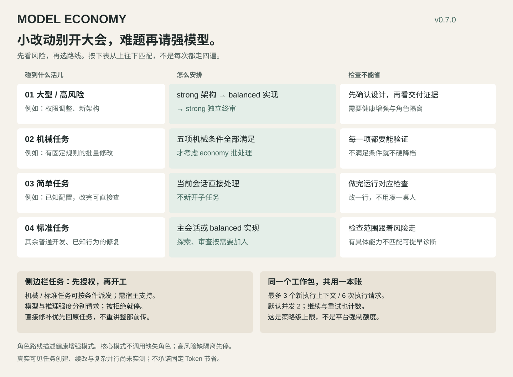

[English](README.md)

# Model Economy

小改动别开大会，难题再请强模型。

免费的开源 Codex 插件：按任务风险安排模型、分工和检查，减少不必要的编排。

- 小任务在当前会话完成，固定规则的批量工作才考虑轻量模型。
- 可按角色设置模型和思考强度；独立可见任务需要你的授权和宿主支持。
- 高风险工作保留设计与审查要求，不为了省事跳过检查。

[当前版本 v0.7.0](docs/release/0.7.0.md) · [安装指南](docs/zh-CN/installation.md) · [反馈问题](https://github.com/BottleYo/model-economy/issues)

<details>
<summary>展开看任务分工图</summary>



</details>

## 安装

需要 Git，以及支持插件命令的 Codex CLI。在终端运行：

```sh
git clone https://github.com/BottleYo/model-economy.git
cd model-economy
codex plugin marketplace add .
codex plugin add model-economy@model-economy-public
```

安装后新建任务，说“本任务使用 Model Economy”。临时不用时，说“本任务不要使用 Model Economy”。

默认是核心模式，无需先配置六角色。自定义模型、六角色增强、用量查看和卸载，按需查阅[安装指南](docs/zh-CN/installation.md)。

## 已经装过？把这段交给 Codex

在要更新的电脑上复制下方指令，不用手动改版本号。

<details>
<summary>展开复制通用更新指令</summary>

```text
请把这台电脑已安装的 Model Economy 更新到 GitHub 最新正式版：
https://github.com/BottleYo/model-economy

先确认最新非预发布 Release、当前安装版本、安装来源、仓库位置，以及是否启用了六角色增强和全局路由。没有可确认的正式版时停止，不把 main 或预发布版当成最新正式版。
按目标版本的安装指南和本机 Codex 支持的命令更新，保留未提交修改、原模型映射和有效推理强度。不要只更新仓库就宣布插件更新成功。
如果有六角色增强，先运行 upgrade --dry-run，确认没有冲突后运行 upgrade，再运行 verify；保留迁移备份。没有增强配置则跳过，不顺手安装。
只有此前启用了全局路由，才用 enable-global-routing 刷新受管理区块。不要用 install/configure 重置旧配置，也不要用 --force 绕过冲突。
不要读取认证或 session 文件，不运行 doctor --smoke，不创建测试子任务，不改其他插件。遇到冲突、命令不支持或来源不明时停止并说明。
最后分别核对插件安装快照和可选增强配置，报告版本、检查结果、备份位置及未完成项，提醒我新建任务使用新规则。status 中的源码版本不等于插件安装快照已更新。
```

</details>

## 使用前知道这几件事

- 这是工作规则，不是平台强制调度器；不会自动切换当前聊天的模型，也不承诺固定 Token 节省。
- 核心模式缺少高风险任务所需的独立角色时，会停下来让你选择处理方式。
- v0.7.0 的自动化检查已通过；真实可见任务创建、续改及复杂并行试点经批准跳过，尚未验证。
- 社区项目，非 OpenAI 官方产品。

## 文档

[工作原理](docs/zh-CN/how-it-works.md) · [CLI 参考](docs/zh-CN/cli-reference.md) · [安全说明](SECURITY.zh-CN.md) · [更新记录](CHANGELOG.zh-CN.md) · [贡献](CONTRIBUTING.md) · [支持](SUPPORT.md)

[MIT 许可证](LICENSE)
